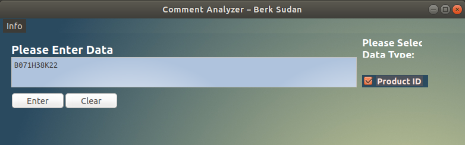
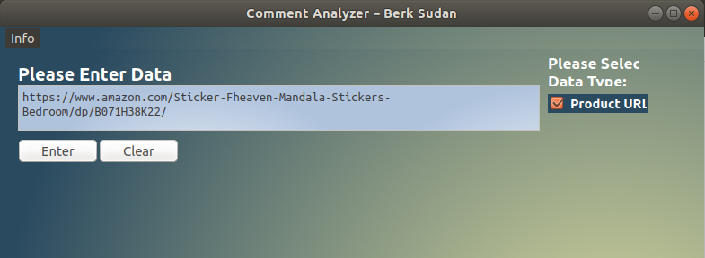
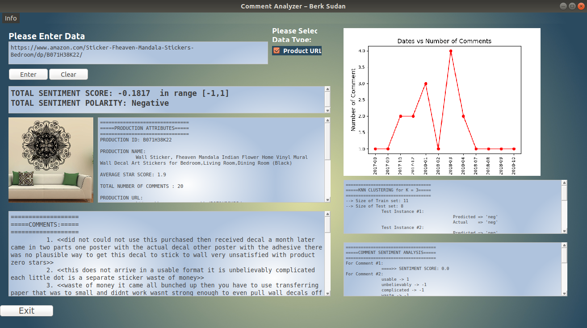

# Sentiment Analysis on E-Commerce

## Abstract
A program has been developed to find the desired product on the Amazon E-Commerce site, collect comments, analyze the sentiments of the comments, and also analyze the sales times of the products.

As Amazon E-Commerce Website is crawled, analyzed & visualized intents of customers.

## Used Modules
- Python 3 as programming language
- NLP (Natural Language Processing) Techniques
- PyQT4 as GUI (Graphical User Interface)
- Beautiful Soup 4 as crawler
- Matplotlib as plotter

## Build
You can build the project by executing following bash file:

```bash
./build.sh
```

Build instructions for Linux is provided only, you can use the equivalent commands for other operating-systems.

## Run
After build, you can enter the following command in your Linux Terminal to run the program:

```bash
./run.sh
```

Note that, since this module does not use Amazon API to access the website, your client can be blocked by Amazon or the HTML tags in the website can be changed in time. 

## Screenshots of GUI Screens

<figure>
  
  <figcaption>Screen of Entering Product ID</figcaption>
</figure>

<figure>
  
  <figcaption>Screen of Entering Product URL</figcaption>
</figure>

<figure>
  
  <figcaption>Screen of Sentiment Results</figcaption>
</figure>

## Folder Structure
```bash
$ tree -L 2
.
├── build.sh
├── commentAnalyzer.py
├── design.py
├── design.ui
├── dictionary_dataset.csv
├── docs
│   ├── enter_screen_product_id.png
│   ├── enter_screen_product_url.png
│   └── product_sentiment_results_screen.png
├── gui_assets
│   ├── 1.jpg
│   ├── app_logo.png
│   └── text_browser_background.png
├── main.py
├── product_files
│   ├── B071H38K22.comments_processed.csv
│   ├── B071H38K22.comments_unprocessed.csv
│   ├── B071H38K22.image.jpg
│   ├── B071H38K22.info.txt
│   ├── B071H38K22.logs
│   ├── B071H38K22.plot.png
│   └── B071H38K22.totalSentScore.txt
├── README.md
└── run.sh

4 directories, 20 files
```

## Contributors
- *Berk Sudan*, [GitHub](https://github.com/berksudan), [LinkedIn](https://linkedin.com/in/berksudan/)

## References
-  The list of English positive and negative opinion words (in file ``dictionary_dataset.csv``) was compiled starting from the paper (Hu and Liu, KDD-2004), as stated in https://www.cs.uic.edu/~liub/FBS/sentiment-analysis.html#lexicon.
